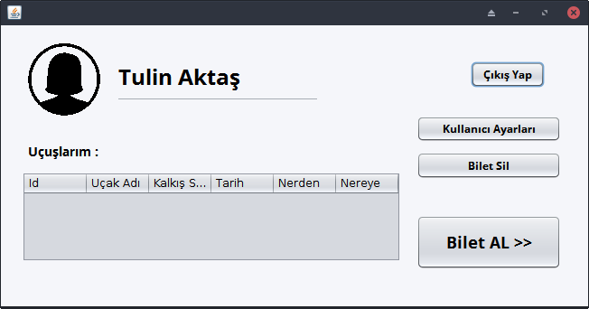
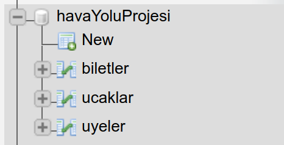

## NYP PROJE ÖDEVİ - 2018                    -Hasan Tezcan
# ÖZ PAU JET TURİZİM HAVAYOLU OTOMASYONU

- Öncelikle projemin GUI'sinden başlayacağım.

### Griş Ekranı :

- Bu ekrandan eğer üyeliğiniz varsa giriş yapabilirsiniz. Yoksa
**Hala hesabın yok mu?** yazısına tıklayarak *kayıt ol ekranına erişebilirsiniz*.

- Ayrıca **Admin paneline** giriş de bu ekrandan gerçekleşmekde.
Email adresi kısmına ve parola kısmına  **admin** yazdığınız takdirde. Admin paneline ulaşabilrsiniz..

 

### Admin Panel :

- Admin panelinde iki adet bölüm bulunmakta.
  - Üye Düzenle
  - Uçak Düzenle

- Üye Düzenleme panelinden hali hazıda üye olan tüm kullanıcıların tüm verilerini görebilirsiniz. Ayrıca onları **düzenleyebilir** ve onları **silebilirsiniz.**.

- Ucak Duzenle ekranında da kayıtlı olan tüm uçakları görebilir onları **düzenleyebilir** onları **silebilirsiniz.** Ayrıca seferleride aynı şekilde bu panel üzerinden **ekliyoruz..**

- Admin panelimiz bu kadardı şimdi kaldığımız yerden yani üye kayıt bölümünden devam edelim..

### Kayıt Ekranımız :

 - Kullanıcıların sisteme üye olduğu ekrandır.

  - Kullanıcılar üyelik sözleşmesini kabul etmeden üye olamazlar.

### Kullanıcı Arayüzü :
- Her üye için ayrı şekillenen bir yapısı vardır.
  -Örneğinn Ömer Sert kullanıcısı **erkek bir üye** olduğu için erkek avatarı yanında yer almakta fakat **kadın bir üye** giriş yapdığında iste kadın avatarı bizleri karşılamaktadır.

- Bu ekrandan **çıkış yap** tuşuna tıklayarak giriş ekranına dönebilrisiniz.
- Uçuşlarım bölümünden son aldığınız uçaklara erişebilirsiniz.

- Bilet al kısmına basarakda bilet alabilirsiniz...

### Bilet Al Ekranı :

- Bielt al ekranında tek yön ve gidiş dönüş tuşlarına basınca panel ona göre şekillenmekdedir.

- Tek yön :

- Gidiş dönüş :

- İstediğiniz kriterleri girp **UÇUŞ ARA** tuşuna bastığınız taktirde size uygun uçuşlar önünüze gelecekdir.

- Sonrasında ise istediğiniz uçağı seçerek **KOLTUK SEÇ** tuşuna basabilirsiniz..

### Koltuk Seçiş Ekranı :

- Bu ekrandan oturmak istediğiniz koltuğu seçebilrsiniz. Tıklanabilir koltuklar boş olarak sayılmaktadır.

- Koltuğunuzu beğendikden sonra **ÖDEME EKRANINA GEÇ** tuşuna basarak ilerleyebilrsiniz.

- Öneme ekranına geçildiğinde seçtiğiniz bilete dair bir özet sizleri beklemekdedir.

- Ödeme bilgilerini eksiksiz girdiğiniz takdirde bileti almış olacaksınız.

- Sonrasında **Kullanıcı Arayüzü** 'ne geri döndüğümüzde daha demin aldığımız bileti burdan görüntüleyebilriz.

## Database :
- Proje 3 adet tablodan oluşmakda..

### 1 - Üyeler :

### 2 - Ucaklar :

## 3 - Biletler :

---

## Classlar:

